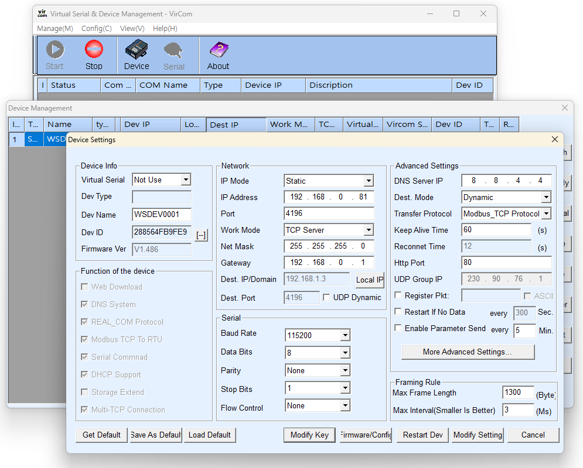
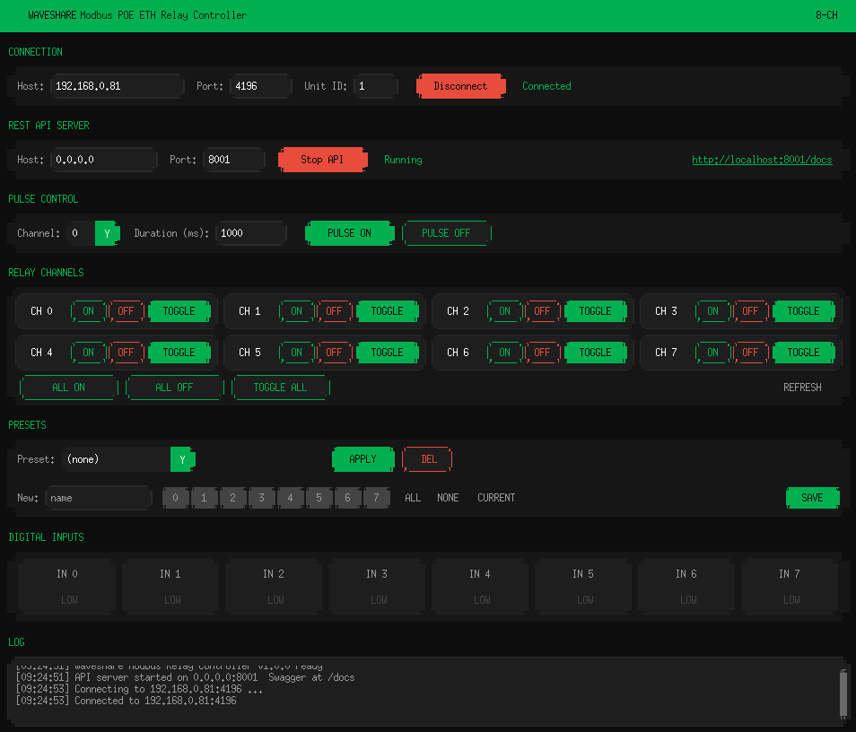

# Waveshare Modbus Relay

> **Fork of [xinfolab/waveshare-modbus-relay](https://github.com/xinfolab/waveshare-modbus-relay).**
> This fork adds a headless (no-GUI) server mode and a Windows service installer.
> Upstream changes are merged periodically. Thanks to the original authors for the foundation.

A control tool for the **Modbus POE ETH Relay (B)** 8-channel relay module.
It provides both a desktop GUI and a REST API, so the relay can be operated locally or remotely.

- Target device: **Modbus POE ETH Relay (B)** — Waveshare 8-channel PoE/Ethernet relay module
- Official documentation: [Waveshare Wiki — Modbus POE ETH Relay (B)](https://www.waveshare.com/wiki/Modbus_POE_ETH_Relay_(B)?srsltid=AfmBOoqHXIP0lN0ZutTYX2NI9LtfKi_U3Tf3CD+8CmoyIPKf1UzXMP9kbe5QK#Overview)

---

## Features

- Per-channel ON / OFF / Toggle control
- Bulk control and batch state setting across all channels
- Pulse control — energize/de-energize for a specified duration
- Digital input status reading
- Per-channel control mode (normal / linked) configuration
- Save and apply frequently-used channel states as **Presets**
- FastAPI-based REST API served alongside the GUI for remote control and automation
- **Headless mode** — run as a pure API server with no GUI, suitable for production/server deployments
- **Windows service installer** — one-script setup via NSSM, starts on boot automatically

---

## Requirements (important)

This tool operates under the default configuration **only when the device's Transfer Protocol is set to `Modbus_TCP_Protocol`**.
If the device is configured with a different protocol (Modbus RTU over TCP, virtual serial, etc.), the connection will not work correctly.
Please set the Transfer Protocol to `Modbus_TCP_Protocol` from the device's web configuration page.

### Configuration example



Default connection parameters:

| Item | Default |
| ---- | ------- |
| Host (IP) | `192.168.0.81` |
| Port | `4196` |
| Unit ID | `1` |
| Transfer Protocol | `Modbus_TCP_Protocol` |

---

## Installation & Run

This project uses [uv](https://github.com/astral-sh/uv).

```bash
# Install dependencies and run (GUI mode)
uv run waveshare-modbus
```

On launch, the GUI opens and the REST API server starts alongside it.

### Running screen



---

## Headless Mode

Run the API server without a GUI — suitable for servers, background processes, and production machines.

```powershell
uv run waveshare-modbus --headless --relay-host 192.168.1.200 --relay-port 502
```

All arguments are optional and fall back to defaults:

| Argument | Default | Description |
| -------- | ------- | ----------- |
| `--relay-host` | `192.168.0.81` | Relay device IP address |
| `--relay-port` | `4196` | Relay device port |
| `--relay-unit` | `1` | Modbus unit ID |
| `--api-host` | `0.0.0.0` | Address the API server binds to |
| `--api-port` | `8001` | Port the API server listens on |

---

## Windows Service (Production Install)

`install.ps1` installs the headless server as a Windows service that starts automatically on boot.
It installs `uv` and NSSM silently if they are not already present.

**Before running the script**, allow PowerShell to execute local scripts (one-time, per machine):

```powershell
Set-ExecutionPolicy -ExecutionPolicy RemoteSigned -Scope CurrentUser
```

Then clone and install:

```powershell
git clone https://github.com/alwaysmohawk/waveshare-modbus-relay.git
cd waveshare-modbus-relay
.\install.ps1
```

The script prompts for the relay device IP, relay port, API port, and service name, then registers and starts the service.

**Managing the service after install:**

```powershell
nssm status  puck-shooter-controller-api
nssm restart puck-shooter-controller-api
nssm stop    puck-shooter-controller-api
nssm remove  puck-shooter-controller-api confirm   # uninstall
```

To change config (e.g. after the relay device IP changes), re-run `.\install.ps1` — it removes and re-registers the service cleanly.

---

## REST API

The API exposes the same functionality as the GUI over HTTP. Key endpoints:

| Method | Path | Description |
| ------ | ---- | ----------- |
| GET    | `/api/status` | Get connection status |
| POST   | `/api/connect` | Connect to the device |
| POST   | `/api/disconnect` | Disconnect |
| GET    | `/api/relays` | Read all relay states |
| POST   | `/api/relays/{ch}/on` \| `/off` \| `/toggle` | Control a single channel |
| POST   | `/api/relays/all/on` \| `/off` \| `/toggle` | Control all channels |
| POST   | `/api/relays/batch` | Set states of all 8 channels at once |
| POST   | `/api/relays/{ch}/pulse` | Pulse control |
| GET    | `/api/inputs` | Read digital input states |
| GET/PUT| `/api/modes` | Read / set per-channel control mode |
| GET    | `/api/device/info` | Device address and firmware info |
| GET/POST/DELETE | `/api/presets` | Manage presets |
| POST   | `/api/presets/{name}/apply` | Apply a preset |

Swagger UI: `http://localhost:<port>/docs`

### Node.js integration

```js
// Connect once at startup
await fetch('http://<host>:8001/api/connect', {
  method: 'POST',
  headers: { 'Content-Type': 'application/json' },
  body: JSON.stringify({ host: '192.168.0.81', port: 4196, unit_id: 1 })
});

// Pulse a relay (fires for 200ms then resets automatically)
async function pulseRelay(channel) {
  const res = await fetch(`http://<host>:8001/api/relays/${channel}/pulse`, {
    method: 'POST',
    headers: { 'Content-Type': 'application/json' },
    body: JSON.stringify({ action: 'on', duration_ms: 200 })
  });
  return res.json();
}
```

Channels are 0–7. Minimum pulse duration is 100ms.

---

## Project structure

```
waveshare-modbus/
├── src/waveshare_modbus/
│   ├── __main__.py      # Entry point (GUI + headless modes)
│   ├── gui.py           # CustomTkinter GUI
│   ├── api.py           # FastAPI REST API
│   ├── modbus_client.py # Modbus TCP client
│   ├── presets.py       # Preset save/load
│   └── presets.json     # Preset data
├── images/              # Screenshots
├── install.ps1          # Windows service installer
├── run.sh               # Launch script (Linux/macOS)
└── pyproject.toml
```

---

## License

Released under the [MIT License](LICENSE).
